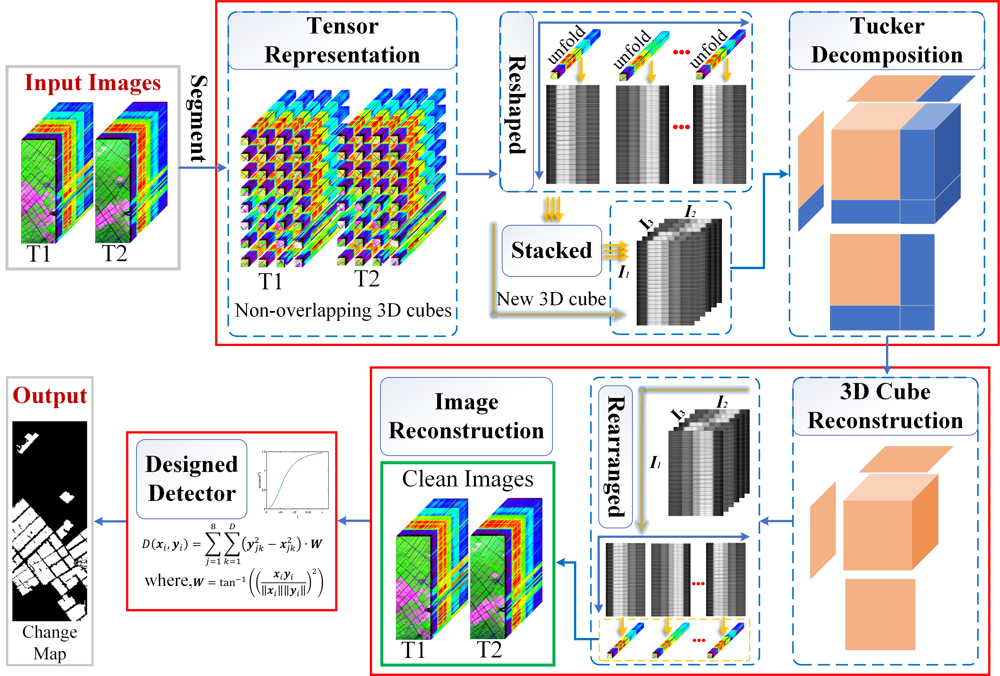

# Hyperspectral-Change-Detection-PTCD
**Paper: A Patch Tensor-based Change Detection Method for Hyperspectral Images**

Fig.1. Framework of proposed PTCD Method.

# Source
**Paper Download:**
- [IGARSS 2021 Paper](https://drive.google.com/file/d/1M9cKwbDn8mbvd7VIx1CmWNKYnGnDm4pO/view?usp=sharing)

**Hermiston dataset:**
- [Google Drive](https://drive.google.com/file/d/1-UqfGNsWXY3UnCjyG1WaDOxietuwF2XG/view?usp=sharing)
- [Baidu Disk, Extraction code: 6c2e](https://pan.baidu.com/s/1u7gHjKtIGZXH3ykCX9APxw)

# Citation
If these codes and dataset are helpful for you, please cite this paper:

**BibTex Format:** 
@ARTICLE{9451632,  author={Hou, Zengfu and Li, Wei and Tao, Ran and Du, Qian}, 
journal={IEEE Journal of Selected Topics in Applied Earth Observations and Remote Sensing}, 
title={Three-Order Tucker Decomposition and Reconstruction Detector for Unsupervised Hyperspectral Change Detection},
year={2021}, 
volume={14}, 
number={}, 
pages={6194-6205},  
doi={10.1109/JSTARS.2021.3088438}}

**Plain Text Format:** 
Z. Hou, W. Li, R. Tao and Q. Du, "Three-Order Tucker Decomposition and Reconstruction Detector for Unsupervised Hyperspectral Change Detection," in IEEE Journal of Selected Topics in Applied Earth Observations and Remote Sensing, vol. 14, pp. 6194-6205, 2021, doi: 10.1109/JSTARS.2021.3088438.

# My Website
- [Github Website](https://zephyrhours.github.io/)
- [Chinese CSDN](https://blog.csdn.net/NBDwo)
